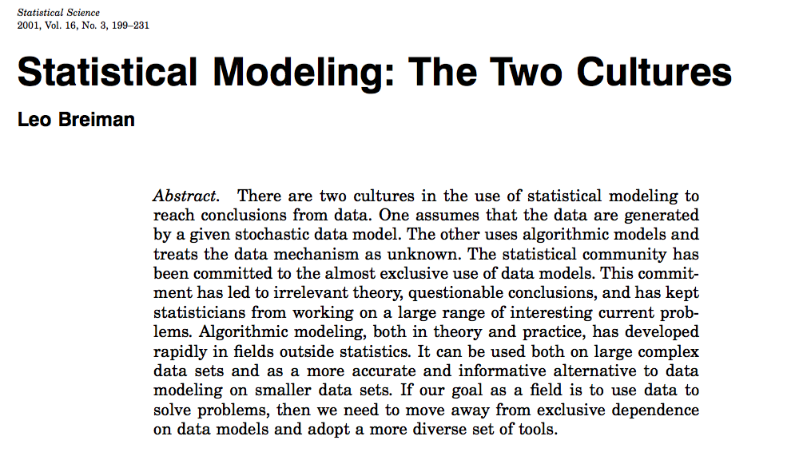
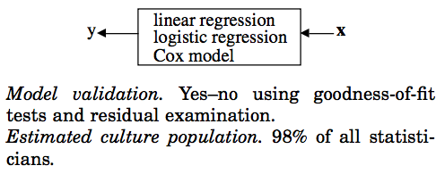
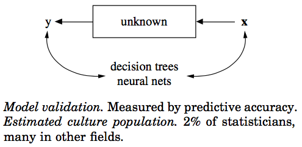

# What is Papers We Love ?

# [around the world](http://paperswelove.org/)

- .. is a [repository](https://github.com/papers-we-love/papers-we-love)
- .. is a community

<http://paperswelove.org/>

# The data science case for \ "Papers we love"

# Data science is multi-disciplinary.

# "multiverse".

----

# Data science is at the intersection of ...

- Statistics
- Machine learning
- Computer science
- Data Engineering
- Visualisation

# Get the Upside

- New ideas from academia and industry practitioners
- Connect ideas to problems

# Avoid the downside

- Validate your own actions
- boundaries (does it even make sense to apply this...)
- Wrong / right
- Do not reinvent square wheels

#  What we can get out of such a thing?

- Research `->` practice
- Practice `->` publish / capture ideas

# Should we always read the latest papers?

- "But, The amount of papers generated is humongous ... how do I keep up?"

# The purpose of research is ...

(Matt Might's illustrated guide to a PhD)

# Sources

- Conferences
- Journals
- By Topic
- By people / group / organisations (companies.. eg: goog, fb, for specialised interests)
-  **Survey papers**

# Outcomes of a papers we love session

... not exhaustive or prescriptive ...

- Name a concept
- Explain the concept
- Explain how it works
- Explain how it is an improvement
- Where to use it. (Upside)
- Where not to use it. (Downside)

# The Paper for today's session

"Statistical modeling: The two cultures" by Leo Breiman, 2001.

# Why I liked this paper

- Talks about experience and experience is king
- Erudition and story telling is appealing
- I do this for fun. not to write an exam.
- Not dry and mathy.

# Two Cultures

"Stochastic Data Model" vs "Algorithmic Model"

# Data modeling (Statistics)

    response variables = f(predictor variables, random noise, params)

"... Assume that the data are generated by the following model: ...."

# Algorithm modeling (Machine Learning)

Find a function $f(x)$ -- an algorithm that operates on $x$ to predict the responses to $y$.

## The issue with Data modeling

The statistician, by imagination and by looking at the data, can invent a reasonably good model to explain the complex mechanism of nature.

----

- The conclusion about the model fit are about the model's mechanism, and not about nature's mechanism
- If the model is a poor emulation of nature, the conclusions may be wrong

----

Data modeling produces a "simple" and "understandable" picture of the
relationship between input and output.

----

But more complicated data models that have appeared suggests that as
data becomes complex, the data models lose the advantage of presenting
a clear picture of nature's mechanism

----

# Algorithmic modeling

- Fitting equations to data
- Predictive accuracy is the goal
- Applied in: speech and image recognition, handwriting recognition, predicting financial markets etc.,

----

Approach: -- "nature produces data in a black box whose insides are complex, mysterious, and at least, partly unknowable".

----

Shifts the focus from data models to properties of algorithms:

- strength as predictors
- convergence (for iterative algorithms)
- whatever gives them good predictive accuracy

# Lessons in Algorithmic modeling

- Roshoman: the multiplicity of good models
- Occam: the conflict between simplicity and accuracy
- Bellman: dimensionality -- curse or blessing

# Roshomon effect

----

# Roshoman effect

"there are often a multiple equations of $f(x)$ giving the same minimum error rate"

ie.,

"They all state the same facts, but their stories of what happened are very different"

# Occam's razor

- usually interpreted as "Simpler is better".

----

- linear regression vs neural networks

----

# Occam's dilemma

"Accuracy generally requires more complex prediction methods. Simple
and interpretable functions do not make the most accurate predictors".

So, the soundest path is to go for predictive accuracy first, and then
try to understand why.

# Bellman and the curse of dimensionality

- The conventional advice was to reduce the number of features.
- Algorithmic modeling has tried to go in the opposite direction

"Instead of reducing dimensionality, increase it by adding many functions of predictor variables"

# Examples ...

- Shape recognition forest
- Support vector machines

# Black box

The goal is to get accurate information, and not interpretability.

# Conclusions

- Focus on finding good solutions (that's what you are paid for)
- Live with the data before you plunge into modeling
- Search for a model that gives a good solution (Algorithmic or Data modeling)
- Predictive accuracy on the test set is the criterion for how good the model is
- Computers are an indespensible partner

# Thank you

The source to the slides are available on github:

- <https://github.com/dsindy/presentations/tree/master/2016-02>
