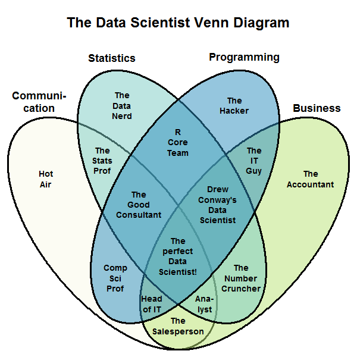

# Scala for datascience
## September 2016
### Pradeep Gowda @ DataScience Indy

----

Courtesy of [Stephan Kolassa](http://datascience.stackexchange.com/a/2406) on DataScience StackExchange.

---

# Survey

* How many use Python
* How many use R
* How many use Scala+Python
* How many use Hadoop/Spark

----

# Why Scala for DS

* Java ecosystem
* Better programming langauge
* Concurrency support
* Functional Programming
* Spark Ecosystem
* Strong open source community

---

# Why Scala (contd...)

* Better programming language

    * Not Java
    * Funtional programming + OOPS
    * REPL
    * "Pythonish"
---

# Why scala  (contd... Functional Programming)
What is functional programming?

* Immutability
* Functions with no side effects
* Referential transparency
* Higher order functions

---

# Why Scala (contd... oops)

* Object Oriented methods still useful
* ... and familiar
* classes
* inheritence
* .. methods ..
* blah... 

---

# How do Python compare?
* Python supports many of the OO Programming ideas
* and some FP (`map`, `reduce`, `apply`)
* `lambda` is severly restricted
* not really encouraged

---

# How does R compare?

* R is actually more FP oriented than python
* In practice more procedural than FP
*  [Evaluating the design of R language](http://r.cs.purdue.edu/pub/ecoop12.pdf); Morandat et. al from Purdue, 2012.
--- 

---

# Why Scala (contd... java ecosystem)

* Instrumentation support
* Many man-centuries of experience around tuning the GC
* Cross platform
* Interoperability with Java
    * can use any Java class
    * can be called from Java (JVM lang)
--- 

# Why Scala (contd... concurrency)

* High performance with Akka 

---

# Scala + Data science ecosystem

* Spark
* Cassandra
* Kafka

---

http://spark.apache.org/

---

# components of Spark

- SQL and dataframes
- MLLib for Machine Learning
- Spark Streaming

---

MLLib

---

# Spark

- Spark is implemented in Scala
- Spark <-> python, a match made in ... 
- Spark streaming (some of the features are not available for py API)
- MLLib leans heavily on parallel processing

---

# Why not Scala

* Java ecosystem
* Scala the langauge can be scary

---

# Scala is for you if ...

* You deal with large datasets
* You are already using Hadoop/Spark/Finagle
* You are a programmer/developer/software engr

You = the team you are part of, work with ... 

---

# Scala may not be for you if ... 

(it's not you, it's me)

* You are more statistician than programmer
* You are more domain expert than programmer

---

# Where to learn Scala

- EdX
- Programming in Scala by Odersky
- Programming Scala by Dean Wampler

--- 

# Scala + DS

- [Databricks community edition](https://community.cloud.databricks.com)

----

# Jupyter Notebook

- Scala kernel for Jupyter
- [Zeppelin notebook](http://christopher5106.github.io/big/data/2015/07/03/iPython-Jupyter-Spark-Notebook-and-Zeppelin-comparison-for-big-data-in-scala-and-python-for-spark-clusters.html)
- [IndyScala presentation](https://github.com/bhoward/IndyScala)

---
